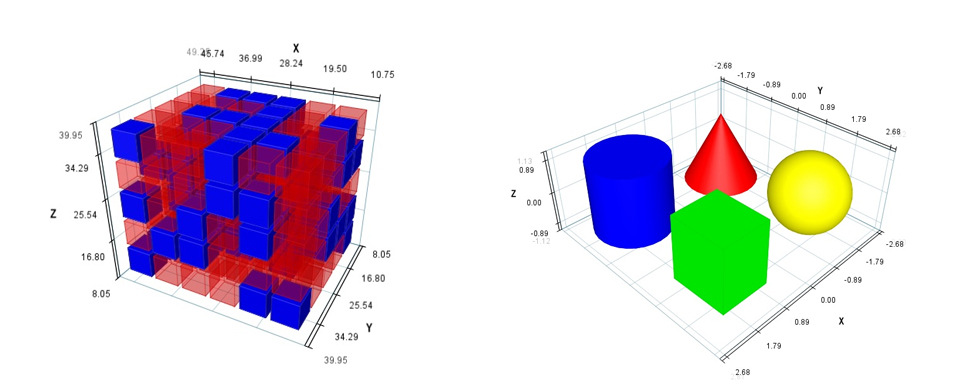

# Matplot3D for Java


### 概述

  在数据科学和工程领域，数据可视化是理解和交流复杂信息的关键工具。如果您是一位Java开发者，寻找一个强大的、本地化的三维图形绘图库，那么Matplot3D for JAVA（V5.0）值得你关注。该组件旨在为Java开发者提供类似于Python中Matplotlib的三维绘图功能，让Java也能轻松绘制出令人印象深刻的3D图形图表。

  **Matplot3D for JAVA（V5.0）** 是一个基于JAVA SE环境开发的三维图形图表组件。 组件由纯JAVA SE 实现（Pure Java） ，封装为一个jar包，jar文件大小只有300多KB。内含自主研发的软件三维几何造型和绘制算法，无需依赖OpenGL、DriectX、JAVA 3D或JAVAFX等等第三方库，其只依托JRE自带的默认类库即可（即只需安装了JAVA就可使用）。

  **Matplot3D for JAVA（V5.0）** 提供简洁明了的API设计，这使得即使是没有太多数据可视化工经验的开发者也可以快速上手构建出交互式的可视化应用。可用于大数据可视化、科学数学数据分析可视化等领域。它利用Java的自带的GUI框架构建界面同，确保了良好的跨平台兼容性同时能方便的集成到自己JAVA GUI程序中。也可以在服务端直接生成图片对象或文件，用于动态Web页面显示。

---

### 应用场景
  

- 教学和研究：用于展示数学模型、物理现象和数据等。
- 数据科学：在数据分析过程中可视化三维数据，帮助发现潜在模式。
- 其他需要数据可视化的Java应用和系统


---

### 包文件说明

 **Matplot3d_4j_sydh_x64_V5.0.jar** 为应用所需要依赖的包，仅将此包文件导入项目即可使用。

 **Matplot3d_4j_sydh_x64_V5.0_demo.jar** 为演示DEMO的可执行的JAR文件，内含展示效果及部分示例代码， **使用时不需要引用这个包** 。如不清楚何运行可执行JAR的请自行百度一下（需要在64bit的JRE上运行）  

---
### 作者联系方式
 **email:ta8334@126.com  ;  QQ :17746302** 

---

### 效果展示

**C60分子结构**

     
<br/> 
<br/> 
￣￣￣￣￣￣￣￣￣￣￣￣￣￣￣￣￣￣￣￣￣￣￣￣￣￣￣￣￣￣￣￣￣￣￣￣

**电荷矢量场**

  
<br/> 
<br/> 
￣￣￣￣￣￣￣￣￣￣￣￣￣￣￣￣￣￣￣￣￣￣￣￣￣￣￣￣￣￣￣￣￣￣￣￣

**地形数据**

  
<br/> 
<br/> 
￣￣￣￣￣￣￣￣￣￣￣￣￣￣￣￣￣￣￣￣￣￣￣￣￣￣￣￣￣￣￣￣￣￣￣￣

**网格曲面** 

  
<br/> 
<br/> 
￣￣￣￣￣￣￣￣￣￣￣￣￣￣￣￣￣￣￣￣￣￣￣￣￣￣￣￣￣￣￣￣￣￣￣￣

**矢量场流线** 

 

简单样例代码
```
public class SimpleVectorFieldDemo {
	public static void main(String[] args) {

		VectorFieldProcessor processer = new VectorFieldProcessor();

		Matplot3D4JMgr matPlot3DMgr = new Matplot3D4JMgr(processer);

		Vector3D v1 = new Vector3D(1, 0, 0);
		Vector3D v2 = new Vector3D(-0.1, 0, 0);
		Vector3D vNull = new Vector3D(0, 0, 0);

		class MyMapper1 implements Point3dVector3dMapper {
			public Vector3D f(Point3D p) {
				if (p.y() > 0) {
					return v1;
				} else {
					return vNull;
				}
			}

			public void setAdditionalPrar(Object additionalprar) {}
		}

		class MyMapper2 implements Point3dVector3dMapper {
			public Vector3D f(Point3D p) {
				if (p.y() < 0) {
					return v2;
				} else {
					return vNull;
				}
			}

			public void setAdditionalPrar(Object additionalprar) {}
		}

		processer.addData(new MyMapper1(), "1", Color.RED, new Range(-9, 9), new Range(-9, 9), new Range(-9, 9));

		processer.addData(new MyMapper2(), "2", Color.BLUE, new Range(-9, 9), new Range(-9, 9), new Range(-9, 9));

		List<Point3D> seeds = new ArrayList<Point3D>();

		for (double z = -9; z <= 9; z += 1.2) {
			for (double y = -9; y <= 9; y += 1.2) {
				seeds.add(new Point3D(0, y, z));
			}
		}

		processer.setPropertyToAll("seeds", seeds);
		processer.setPropertyToAll("alphaNoise", 0.0);

		matPlot3DMgr.setTitle("矢量场流线");
		matPlot3DMgr.setAppearanceTheme(Matplot3D4JMgr.APPEARANCE_THEME_DARK);

		matPlot3DMgr.setCoordianteSysShowType(Matplot3D4JMgr.COORDINATE_SYS_ALWAYS_FURTHER);

		matPlot3DMgr.showMotion(-1, 15, 0);
	}
}   
 
```

<br/> 
<br/> 
￣￣￣￣￣￣￣￣￣￣￣￣￣￣￣￣￣￣￣￣￣￣￣￣￣￣￣￣￣￣￣￣￣￣￣￣

**数据阵列曲面** 

  

简单样例代码
```
public class FunctionSurfaceDemo {

	public static void main(String[] args) {

		DataGridProcessor processor = new DataGridProcessor();
		
		final Matplot3D4JMgr mgr=new Matplot3D4JMgr(processor);		

		//定义二维函数，根据xy值求y值
		Function f = new Function() {
			public Double f(double x, double y) {
				return Math.sin(y * x / 2.2) * 0.8;
			}
		};

		double pi = Math.PI;

		//将二维函数加入处理器，设置XY方向显示范围和采样分段数
		Range rangeX = new Range(-1.5 * pi, 1.5 * pi);
		Range rangeY = new Range(-1.5 * pi, 1.5 * pi);

		// 将二维函数加入处理器，设置XY方向显示范围和采样分段数
		processor.addData(FunctionSpaceUtil.getDataByFunction(f, rangeX, rangeY, 60, 60), "", rangeX, rangeY, new TopBottomColorStyle(Colors.Jet), 1f);
		
		processor.setPropertyToAll("isDoubleSide", true);

		mgr.setScaleZ(1.5);
		mgr.setScaleX(1.3);
		mgr.setScaleY(1.3);

		mgr.setElevation(1.3);
		mgr.setAzimuth(1.1);

		mgr.setTitle("Demo : 函数曲面绘制   [ z =  0.8 * sin(y*x/2.2) ]");

		mgr.setCoordianteSysShowType(mgr.COORDINATE_SYS_ALWAYS_FURTHER);

		mgr.show();
	}
} 
 
```
<br/> 
<br/> 
￣￣￣￣￣￣￣￣￣￣￣￣￣￣￣￣￣￣￣￣￣￣￣￣￣￣￣￣￣￣￣￣￣￣￣￣

**通用网格** 

  
<br/> 
<br/> 
￣￣￣￣￣￣￣￣￣￣￣￣￣￣￣￣￣￣￣￣￣￣￣￣￣￣￣￣￣￣￣￣￣￣￣￣

**曲面云图** 

  

简单样例代码
```
public class ContourDataGridDemo {
	public static void main(String[] args) {
		
		ContourDataGridProcessor processor = new ContourDataGridProcessor();
		
		Matplot3D4JMgr mgr=new Matplot3D4JMgr(processor);		
		
		//=======================================
		//准备你的高度数据，是一个二维Double数组。表示均匀分布的网格点，数组内的值表示高度
		//数据一般来源于具体应用的非规则函数数据，例如某区域的DEM地形高程数据
		//以下代码创造一些虚拟数据用于展示如何使用
		
		Double[][] datas=new Double[100][100];
		
		for(int i=0;i<datas.length;i++) {
			for(int j=0;j<datas[0].length;j++) {
		
				datas[i][j]=-0.1*Math.pow(100d-i-j,2)+1000;
				
			}
		}

		//=======================================
		//准备你的显示数据values，是一个二维Double数组，。表示均匀分布的网格点，数组内的值表示非xyz的第四维标量数据
		//values的行列分布可以不与datas一致，但建议最好一致以优化显示效果
		//以下代码创造一些虚拟数据用于展示如何使用
		
		Double[][] values=new Double[50][50];
		for(int i=0;i<values.length;i++) {
			for(int j=0;j<values[0].length;j++) {
				double temp=Math.sqrt(Math.pow(i-25d,2)+Math.pow(j-25d,2));
				values[i][j]=temp;
			}
		}

		Color baseColor=Color.GRAY;//云图需要一个基色
		
		processor.addData(datas, values,baseColor, "my_name", new Range(0, 100), new Range(100, 200), 20, 20, 1f);
		
		processor.setClose3DObject(true);//设置是否是封闭三维对象

		mgr.setCoordianteSysShowType(Matplot3D4JMgr.COORDINATE_SYS_ALWAYS_FURTHER);
		
		mgr.setScaleX(5);
		mgr.setScaleY(5);
		mgr.setScaleZ(0.2);

		mgr.setTitle("曲面云图简单样例");
		
		mgr.show();
	}
}
 
```
<br/> 
<br/> 
￣￣￣￣￣￣￣￣￣￣￣￣￣￣￣￣￣￣￣￣￣￣￣￣￣￣￣￣￣￣￣￣￣￣￣￣

**柱状图** 

  

简单样例代码
```
public class BarsDemo {

	public static void main(String[] args) {

		BarProcessor processor = new BarProcessor();

		Matplot3D4JMgr mgr = new Matplot3D4JMgr(processor);

		// ===========================================
		// 在此准备数据
		Double[][] ds1 = new Double[][] { { 1.0, 2.0, 3.0, 4.0, 5.0, 6.0, 7.0, 8.0 },
				{ 2.0, 3.0, 4.0, 5.0, 6.0, 7.0, 8.0, 9.0 }, { 3.0, 4.0, 5.0, 6.0, 7.0, 8.0, 9.0, 10.0 } };

		Color c1 = Color.RED;
		Color c2 = Color.GREEN;
		Color c3 = new Color(80, 80, 255);

		Color[][] colors = new Color[][] { { c1, c1, c1, c1, c1, c1, c1, c1 }, { c2, c2, c2, c2, c2, c2, c2, c2 },
				{ c3, c3, c3, c3, c3, c3, c3, c3 } };

		Color ce = Color.BLACK;

		Color[][] ecolors = new Color[][] { { ce, ce, ce, ce, ce, ce, ce, ce }, { ce, ce, ce, ce, ce, ce, ce, ce },
				{ ce, ce, ce, ce, ce, ce, ce, ce } };
		

		processor.addData("项目1", ds1,colors,ecolors);


		processor.setBarWidthX(2);
		processor.setBarWidthY(2);

		processor.setxSpace(0.2);
		processor.setySpace(1);
		processor.setSpaceInGroup(0.3);

		//自定义标签图例面板
		KeyLabelLegend legend = new KeyLabelLegend();
		legend.put("项目A", c1);
		legend.put("项目B", c2);
		legend.put("项目C", c3);

		mgr.addLegend(legend);

		mgr.setScaleZ(1.5);
		mgr.setScaleX(1.3);

		mgr.setTitle("柱状图");

		mgr.setElevation(0.2);
		mgr.setAzimuth(2.2);

		mgr.setOutlineAntiAliasing(false);//可以关闭外廓反锯齿

		mgr.show();
	}

}
 
```
<br/> 
<br/> 
￣￣￣￣￣￣￣￣￣￣￣￣￣￣￣￣￣￣￣￣￣￣￣￣￣￣￣￣￣￣￣￣￣￣￣￣

**瀑布图** 

  

简单样例代码
```
public class SimpleWaterfallDemo {
	public static void main(String[] args) {
	
		Waterfall3DProcessor processer = new Waterfall3DProcessor();
		Matplot3D4JMgr mgr = new Matplot3D4JMgr(processer);

		int stepC = 300;
		double step = 0.05;

		processer.setGroupSpacing(1);//设置间距为1

		//第一组图形
		List<Point2D.Double> li1 = new ArrayList<Point2D.Double>();

		for (int i = 0; i < stepC; i++) {
			li1.add(new Point2D.Double(i * step, Math.sin(i * step)));
		}

		processer.addData("Item 1", null, li1);
		
		//第二组图形
		List<Point2D.Double> li2 = new ArrayList<Point2D.Double>();

		for (int i = 0; i < stepC; i++) {
			li2.add(new Point2D.Double(i * step, Math.cos(i * step)));
		}

		processer.addData("Item 2", null, li2);

		processer.setBaseZ(-1); 

		mgr.setScaleZ(1.5);

		mgr.show();
	}
}
 
```
 <br/> 
<br/> 
￣￣￣￣￣￣￣￣￣￣￣￣￣￣￣￣￣￣￣￣￣￣￣￣￣￣￣￣￣￣￣￣￣￣￣￣

**点云散点** 

  

简单样例代码
```
public class DotsDemo {

	public static void main(String[] args) throws Exception {
	
		ScatterDataProcessor processor = new ScatterDataProcessor();

		final Matplot3D4JMgr mgr=new Matplot3D4JMgr(processor);		
		
		//*************************************************************//
		//在此准备数据，将Point3D对象放入List<Point3D>容器中
		//prepare your data here

		List<Point3D> dos1=new ArrayList<Point3D>();
		List<Point3D> dos2=new ArrayList<Point3D>();
		List<Point3D> dos3=new ArrayList<Point3D>();
		
		Random ram=new Random();
		
		for(int i=0;i<100;i++) {
			
			dos1.add(new Point3D(ram.nextDouble()+1,ram.nextDouble(),ram.nextDouble()+1));
			dos2.add(new Point3D(ram.nextDouble()+1,ram.nextDouble()+1,ram.nextDouble()));
			dos3.add(new Point3D(ram.nextDouble(),ram.nextDouble()+1,ram.nextDouble()));
		}
		
		//加入第一组数据
		processor.addData("Item 1", dos1);
	    
		//加入第二组数据
		processor.addData("Item 2", dos2);
		
		//加入第三组数据
		processor.addData("Item 3", dos3);
		
		processer.setPropertyToAll("isShowEdge", true);

		mgr.setTitle("散点图");

		//坐标参考平面不会遮挡数据
		mgr. setCoordianteSysShowType( Matplot3D4JMgr.COORDINATE_SYS_ALWAYS_FURTHER);

		mgr.show();
	}
}
 
```
 <br/> 
<br/> 
￣￣￣￣￣￣￣￣￣￣￣￣￣￣￣￣￣￣￣￣￣￣￣￣￣￣￣￣￣￣￣￣￣￣￣￣

**简单几何体** 

  

简单样例代码
```
public class SimpleElementsDemo {
	public static void main(String[] args) throws Exception {
		
		Simple3DElementProcessor processor = new Simple3DElementProcessor();

		final Matplot3D4JMgr mgr=new Matplot3D4JMgr(processor);		
		
		processor.addSphere(new Point3D(-1.5,1.5,0 ), 1,39,20, Color.YELLOW);
		
		processor.addCuboid(new Point3D(1.5,1.5,0 ), 1.3,1.5,1.7, Color.GREEN);

		processor.addCone(new Point3D(-1.5,-1.5,-0.9 ), new Point3D(-1.5,-1.5,1.0 ),1,30, Color.RED);
		
		processor.addCylinder(new Point3D(1.5,-1.5,-0.9 ), new Point3D(1.5,-1.5,1.0 ),1,30, Color.BLUE);

		mgr.setTitle("简单几何体");

		mgr.show();
	}
}
 
```
 <br/> 
<br/> 
￣￣￣￣￣￣￣￣￣￣￣￣￣￣￣￣￣￣￣￣￣￣￣￣￣￣￣￣￣￣￣￣￣￣￣￣

**折线曲线** 

  

简单样例代码
```
public class CurveDemo {

	public static void main(String[] args) throws Exception {
	
		CurveProcessor processor = new CurveProcessor();

		final Matplot3D4JMgr mgr=new Matplot3D4JMgr(processor);		
		
		List<Point3D> list=new ArrayList<Point3D>();
		
		list.add(new Point3D(0, 0, 0));
		list.add(new Point3D(0, 0, 1));
		list.add(new Point3D(1, 0, 1));
		list.add(new Point3D(1, 0.3, 0));
		list.add(new Point3D(1, 0.7, 0));
		list.add(new Point3D(1, 1, 1));
		list.add(new Point3D(0, 1, 1));
		list.add(new Point3D(0, 1, 0));
		
		processor.addData(list, "折线A", Color.RED, 1);

		mgr.setTitle("三维折线");
		
		mgr.setElevation(0.06);
		mgr.setAzimuth(0.36);

		mgr.show();
	}
}
 
```
 <br/> 
<br/> 


    


