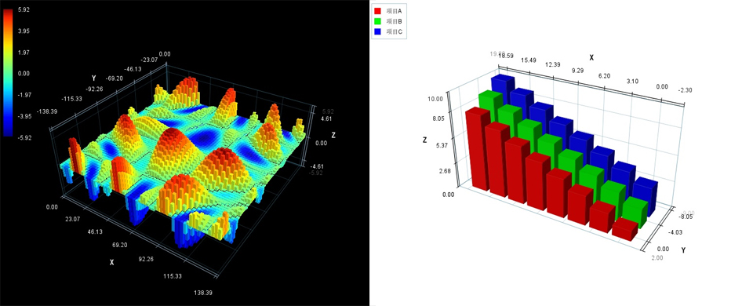

# Matplot3D for Java

### 概述

  在数据科学和工程领域，数据可视化是理解和交流复杂信息的关键工具。如果您是一位Java开发者，寻找一个强大的、本地化的三维图形绘图库，那么Matplot3D for JAVA（V5.0）值得你关注。该组件旨在为Java开发者提供类似于Python中Matplotlib的三维绘图功能，让Java也能轻松绘制出令人印象深刻的3D图形图表。

  **Matplot3D for JAVA（V5.0）** 是一个基于JAVA SE环境开发的三维图形图表组件。 组件由纯JAVA SE 实现（Pure Java） ，封装为一个jar包，jar文件大小只有300多KB。内含自主研发的软件三维几何造型和绘制算法，无需依赖OpenGL、DriectX、JAVA 3D或JAVAFX等等第三方库，其只依托JRE自带的默认类库即可（即只需安装了JAVA就可使用）。

  **Matplot3D for JAVA（V5.0）** 提供简洁明了的API设计，这使得即使是没有太多数据可视化工经验的开发者也可以快速上手构建出交互式的可视化应用。可用于大数据可视化、科学数学数据分析可视化等领域。它利用Java的自带的GUI框架构建界面同，确保了良好的跨平台兼容性同时能方便的集成到自己JAVA GUI程序中。也可以在服务端直接生成图片对象或文件，用于动态Web页面显示。

---

### 应用场景
  

- 教学和研究：用于展示数学模型、物理现象和数据等。
- 数据科学：在数据分析过程中可视化三维数据，帮助发现潜在模式。
- 其他需要数据可视化的Java应用和系统

---

### 包文件说明

 **Matplot3d_4j_sydh_x64_V5.0.jar** 为应用所需要依赖的包，仅将此包文件导入项目即可使用。

 **Matplot3d_4j_sydh_x64_V5.0_demo.jar** 为演示DEMO的可执行的JAR文件，内含展示效果及部分示例代码， **使用时不需要引用这个包** 。如不清楚何运行可执行JAR的请自行百度一下（需要在64bit的JRE上运行）  

---
### 作者联系方式
 **email:ta8334@126.com  ;  QQ :17746302** 

---

### 效果展示

**C60分子结构**

          
  
  

￣￣￣￣￣￣￣￣￣￣￣￣￣￣￣￣￣￣￣￣￣￣￣￣￣￣￣￣￣￣￣￣￣￣￣￣

**电荷矢量场**

  
  
  
￣￣￣￣￣￣￣￣￣￣￣￣￣￣￣￣￣￣￣￣￣￣￣￣￣￣￣￣￣￣￣￣￣￣￣￣

**地形数据**

  
  
  
￣￣￣￣￣￣￣￣￣￣￣￣￣￣￣￣￣￣￣￣￣￣￣￣￣￣￣￣￣￣￣￣￣￣￣￣

**网格曲面** 

  
  
  
￣￣￣￣￣￣￣￣￣￣￣￣￣￣￣￣￣￣￣￣￣￣￣￣￣￣￣￣￣￣￣￣￣￣￣￣

**矢量场流线** 

  
  
  
￣￣￣￣￣￣￣￣￣￣￣￣￣￣￣￣￣￣￣￣￣￣￣￣￣￣￣￣￣￣￣￣￣￣￣￣

**数据阵列曲面** 

  
  
  
￣￣￣￣￣￣￣￣￣￣￣￣￣￣￣￣￣￣￣￣￣￣￣￣￣￣￣￣￣￣￣￣￣￣￣￣

**通用网格** 

  
  
  
￣￣￣￣￣￣￣￣￣￣￣￣￣￣￣￣￣￣￣￣￣￣￣￣￣￣￣￣￣￣￣￣￣￣￣￣

**曲面云图** 

  
  
  
￣￣￣￣￣￣￣￣￣￣￣￣￣￣￣￣￣￣￣￣￣￣￣￣￣￣￣￣￣￣￣￣￣￣￣￣

**柱状图** 

  
  
  
￣￣￣￣￣￣￣￣￣￣￣￣￣￣￣￣￣￣￣￣￣￣￣￣￣￣￣￣￣￣￣￣￣￣￣￣

**瀑布图** 

  
   
  
￣￣￣￣￣￣￣￣￣￣￣￣￣￣￣￣￣￣￣￣￣￣￣￣￣￣￣￣￣￣￣￣￣￣￣￣

**点云散点** 

  
   
  
￣￣￣￣￣￣￣￣￣￣￣￣￣￣￣￣￣￣￣￣￣￣￣￣￣￣￣￣￣￣￣￣￣￣￣￣

**简单几何体** 

  
   
  
￣￣￣￣￣￣￣￣￣￣￣￣￣￣￣￣￣￣￣￣￣￣￣￣￣￣￣￣￣￣￣￣￣￣￣￣

**折线曲线** 

  
   
  

    

